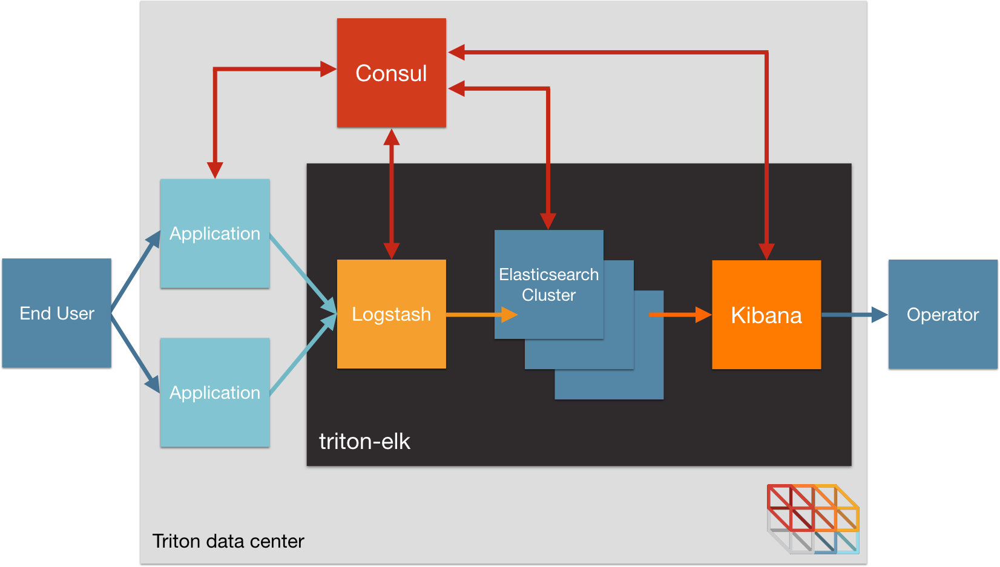
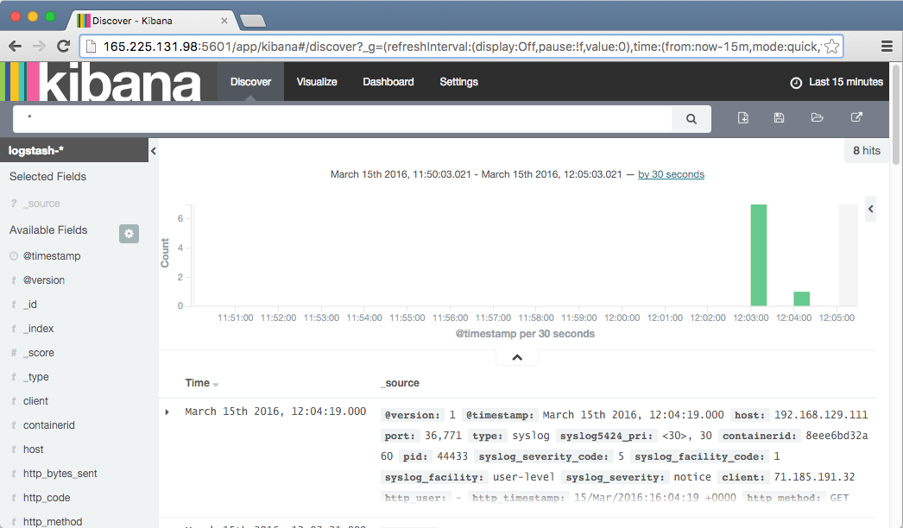

triton-elk
==========

*[Autopilot pattern](http://autopilotpattern.io/) implementation of ELK*

This repo is a demonstration of the [Elasticsearch-Logstash-Kibana (ELK)](https://www.elastic.co/products) stack, designed to be self-operating according to the [autopilot pattern](http://autopilotpattern.io/). This application also demonstrates Triton support of Docker log drivers.

The components of this stack are:

- [Elasticsearch](https://www.elastic.co/products/elasticsearch), to store and search our logs.
- [Logstash](https://www.elastic.co/products/logstash), to ingest logs from our containers and write them to Elasticsearch.
- [Kibana](https://www.elastic.co/products/kibana), as a web UI to search the logs we store in Elasticsearch.
- [Consul](https://www.consul.io/), acting a service catalog to support discovery
- [Containerbuddy](http://containerbuddy.io), to help with service discovery and bootstrap orchestration
- [Triton](https://www.joyent.com/), Joyent's container-native infrastructure platform, including the new [Docker log drivers](https://www.joyent.com/blog/docker-log-drivers) support.
- Nginx, acting as a source of logs for testing.



The ELK stack components all have configuration files that expect hard-coded IP addresses for their dependencies; Kibana and Logstash need an IP for Elasticsearch and Elasticsearch nodes need the IP of one other node to bootstrap clustering. Each container has a startup script configured as a Containerbuddy `onStart` handler to update the config file prior to starting the main application.

Additionally, the ELK application expects certain indexes to be created in Elasticsearch. When the Kibana application starts, the `onStart` handler script (`manage.sh`) will write these indexes to Elasticsearch and will send a log entry to Logstash so that the Logstash application can create its initial schema.

### Getting started

1. [Get a Joyent account](https://my.joyent.com/landing/signup/) and [add your SSH key](https://docs.joyent.com/public-cloud/getting-started).
1. Install the [Docker Toolbox](https://docs.docker.com/installation/mac/) (including `docker` and `docker-compose`) on your laptop or other environment, as well as the [Joyent Triton CLI](https://www.joyent.com/blog/introducing-the-triton-command-line-tool) (`triton` replaces our old `sdc-*` CLI tools)
1. [Configure Docker and Docker Compose for use with Joyent](https://docs.joyent.com/public-cloud/api-access/docker):

```bash
curl -O https://raw.githubusercontent.com/joyent/sdc-docker/master/tools/sdc-docker-setup.sh && chmod +x sdc-docker-setup.sh
./sdc-docker-setup.sh -k us-east-1.api.joyent.com <ACCOUNT> ~/.ssh/<PRIVATE_KEY_FILE>

Check that everything is configured correctly by running `./test.sh check`. If it returns without an error you're all set.


### Start the stack

You can run the entire application with just Docker Compose:

```sh
$ docker-compose -p elk up -d
Creating elk_consul_1
Creating elk_elasticsearch_master_1
Creating elk_elasticsearch_1
Creating elk_elasticsearch_data_1
Creating elk_logstash_1
Creating elk_kibana_1

$ docker-compose -p elk ps

Name                          Command           State    Ports
--------------------------------------------------------------------------------
elk_consul_1                 /bin/start -server    Up   53/tcp, 53/udp,
                             -bootst ...                8300/tcp, 8301/tcp,
                                                        8301/udp, 8302/tcp,
                                                        8302/udp, 8400/tcp,
                                                        0.0.0.0:8500->8500/tcp
elk_elasticsearch_1          /bin/containerbuddy   Up   9200/tcp, 9300/tcp
                             /usr/share/elastic...
elk_elasticsearch_data_1     /bin/containerbuddy   Up   9200/tcp, 9300/tcp
                             /usr/share/elastic...
elk_elasticsearch_master_1   /bin/containerbuddy   Up   9200/tcp, 9300/tcp
                             /usr/share/elastic...
elk_kibana_1                 /bin/containerbuddy   Up   0.0.0.0:5601->5601/tcp
                             /usr/share/kibana...
elk_logstash_1               /bin/containerbuddy   Up   0.0.0.0:12201->12201/tcp,
                             /usr/share/logstas...      0.0.0.0:12201->12201/udp
                                                        24224/tcp,
                                                        0.0.0.0:514->514/tcp,
                                                        0.0.0.0:514->514/udp

```

Within a few moments all components of the application will be registered in the Consul discovery service and will have found the other components they need. We can add new nodes to Elasticsearch just by running `docker-compose -p scale <node type>=<number of nodes>`.

### Run the test rig

The test script included with this repo can open the Consul and Kibana web consoles on systems that support the `open` command (ex. OS X):

```
./test.sh show
Waiting for Consul...
Opening Consul console... Refresh the page to watch services register.
Waiting for Kibana to register as healthy...
Opening Kibana console.
```

This repo also includes a Docker Compose file for starting Nginx containers that are configured to use either the syslog or gelf log driver.

```sh
$ ./test.sh -p elk test syslog
Starting Nginx log source...
Pulling nginx_syslog (0x74696d/triton-nginx:latest)...
latest: Pulling from 0x74696d/triton-nginx
...
Creating elk_nginx_syslog_1
Waiting for Nginx to register as healthy...

Opening web page.

```

HTTP requests that we send to Nginx will be logged and be visible in Kibana.


